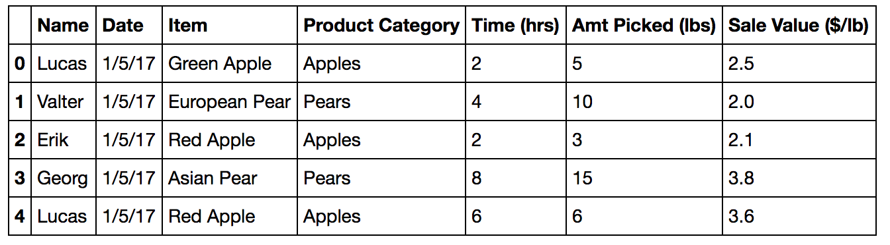
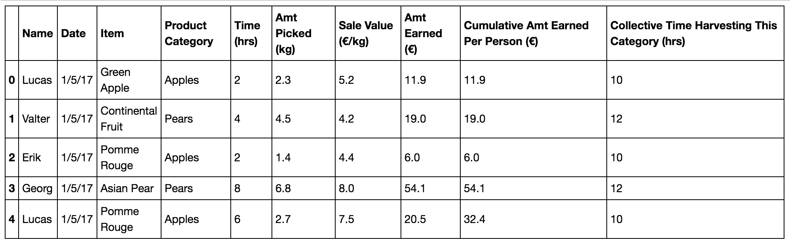
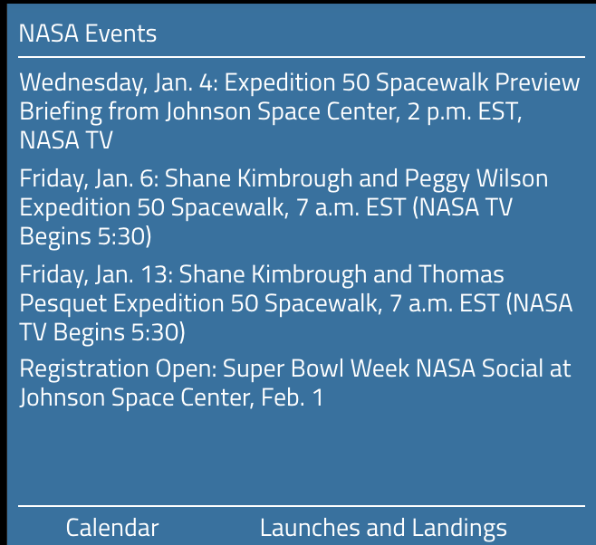
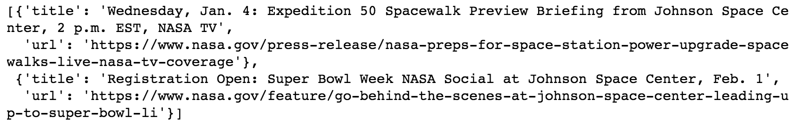
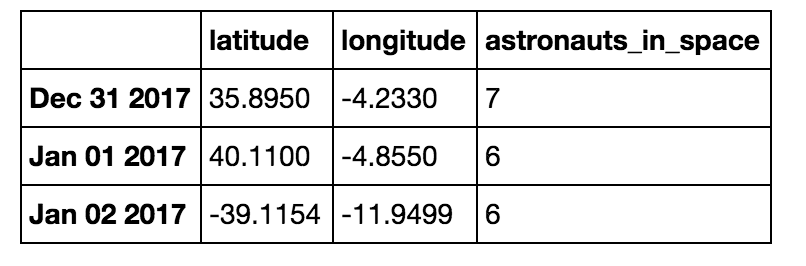

# better-work-done-faster
A repository for illustrating how to use Python to get better work done faster.

Python is a general purpose programming language. There are many great tutorials online for learning Python, including:
- [Codecademy](https://www.codecademy.com/learn/python)
- [Dataquest](https://www.dataquest.io)
- [Google's Python Class](https://developers.google.com/edu/python/)

This repo is not intended to be a tutorial. If you're looking for a course that first grounds you in fundamental concepts and methodologies, you are in the wrong place. This repo is intended to get you excited about the prospect of learning Python by giving concrete examples of how you can actually apply it to your life. It is targeted at business people and career switchers who have been hearing "learn to code" for years, but are still skeptical about how it will help them get more work done faster and don't have 10,000 hours to commit to mastering a new skill.

The basic philosophy behind these materials is:

- Show you how Python can help you get better work done faster, so that you are more intrinsically motivated to continue learning the language elsewhere.
- Guide you in how to set up a local learning environment, so that you can start writing logic  and seeing it work on your behalf immediately.

NB: These materials reference Python 3.x.

## What can I do with Python at work?
### Spreadsheets
If your work involves performing tasks in spreadsheets, then Python can help you get better work done faster.

Imagine you are overseeing a Swedish orchard harvest. Every day you download a .csv file or Excel spreadsheet detailing the day's haul. Unfortunately, the file is never formatted in the right way, and you need to modify it before you can do your analysis. How annoying!

Imagine that your file looks like this:

And you need to make these modifications:
- A "European Pear" should be called a "Continental Fruit" and a "Red Apple" should be called a "Pomme Rouge."
- The Amt Picked and Sale Value should be quoted in kilograms and €/kilogram, not lbs and $/lb respectively.
- An additional column should calculate the total € earned by each person for each day's harvest.
- An additional column should tally the cumulative € that each harvester has earned that day.
- A final column should calculate the collective time spent harvesting each item's Product Category on that day, across all harvesters.

If you have ever worked with a spreadsheet, odds are that you have spent countless hours making changes just like these, over and over again. These mindless tasks sap your creative energy, distract you from more impactful analysis, and it is difficult for others to review or troubleshoot your modifications. Worst of all, when you download this file tomorrow, you have to make the same rote changes all over again.

With Python, you can write a script that executes all these tasks for you in seconds! And the best part is, once you've written the script once, you can run it as many times as you want and it will always run the same way. Like they say in the old Ronco infomercials, you just ["Set It and Forget It!"](https://www.youtube.com/watch?v=tLq27iOW0R0)

With just 20 lines of code, available [here](code_samples/spreadsheet_transformation.ipynb), we can transform the spreadsheet to suit our purposes.

Et voila! The spreadsheet is now ready for whatever needs to happen next, from sharing it as a report, to creating visualizations, to running more advanced analysis on top of it.

### Web Data, part 1
If your work involves gathering data from the web, then Python can help you get better work done faster.

Imagine you are a Texas-based astronomer trying to check whether any human space activities are interfering with your celestial readings. Every day, you visit the [NASA website](https://www.nasa.gov/) to read the latest events, like the ones below:

One morning, you realize that you don't actually care about seeing all of NASA's events, because reading through this list is burning valuable time. All you want is to be alerted whenever something is happening at the Johnson Space Center in Houston.

With Python, you can write a script to read through text on the web *for you*. With just 15 lines of code, available [here](code_samples/web_data.ipynb) Python can extract and deliver all the information you need.

### Web Data, part 2
Now imagine that you want to improve your celestial awareness further by tracking the location of the International Space Station overhead and the number of astronauts currently in space.

Fortunately, the ISS maintains an **open API** ("application programming interface") where we can find this information quickly.

If you are new to programming, API is a scary word. Everyone throws it around so casually, but what actually is it and how do you *use* one? In the context of web data, an API is nothing other than a specialized web server just waiting to return information, as long as you ask for it in the right way. APIs are hosted at web endpoints (e.g., http://api.open-notify.org/iss-now.json). Sometimes these function like typical websites (e.g., if you navigate to the above link, it will display the current ISS location information in a web browser). Sometimes they don't. Most web APIs are accompanied by documentation (e.g., [iss-now](http://open-notify.org/Open-Notify-API/ISS-Location-Now/)) that specify the required inputs and outputs. Many require you to register with the API provider first to obtain an API key or security token.

 Python makes it easy to collect the web data via API (leaving aside the fact that the ISS moves at 28,000km/hr, so your daily observations are not worth much...). With [this script](code_samples/web_data_2), you can programmatically collect the ISS's location every day and add it to your existing collection, yielding a result like this:

### Next steps

These examples are just the tip of the iceberg for demonstrating the power and utility of Python at work. Now it's time to empower you to see these things in action yourself. To this end, let's [configure your local environment for rapid Python learning](FIRST_PROJECT.md).
